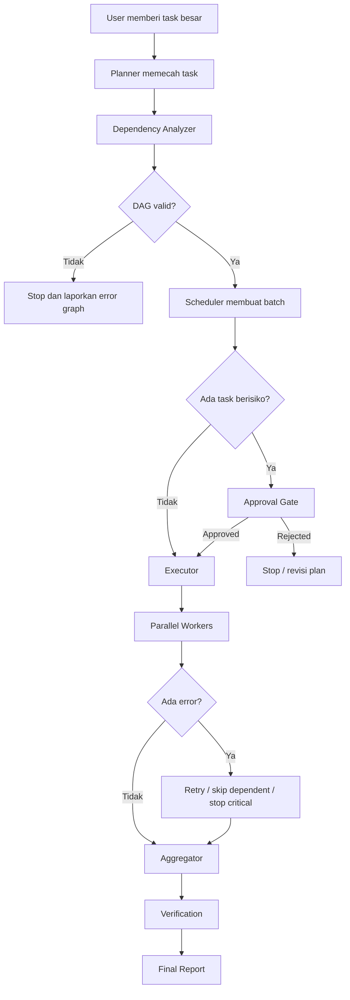

# Roadmap: Orkestrasi Pemecahan Task Secara Paralel

## Tujuan

Membangun kemampuan Smara untuk memecah task besar menjadi subtask, menentukan dependency antar-subtask, menjalankan subtask independen secara paralel, lalu menggabungkan hasilnya secara aman dan terstruktur.

## MVP Scope

1. Task graph sederhana berbasis DAG.
2. Parallel batch untuk task read-only dan independen.
3. Approval gate untuk task mutating atau berisiko.
4. Concurrency limit.
5. Aggregated report.
6. Test dasar untuk dependency, parallel batch, dan error handling.

## Roadmap Ringkas

| Phase | Fokus | Output | Status |
|---|---|---|---|
| 1 | Foundation model task orchestration | Struktur data dan kontrak result standar | Done |
| 2 | Planner dan dependency analyzer | Task besar bisa dipecah menjadi DAG valid | Done |
| 3 | Scheduler paralel | Batch paralel/serial/gated terbentuk deterministik | Done |
| 4 | Executor | Batch berjalan dengan concurrency limit, timeout, retry, status | Done |
| 5 | Safety guardrail | Approval gate, risk policy, conflict detection, resource lock | Done |
| 6 | Aggregator dan reporting | Hasil subtask digabung menjadi laporan final/progress | Done |
| 7 | Verification dan hardening | Test, dry-run, observability, serial fallback | Planned |

---

# Detail Semua Phase

## Phase 1 — Foundation: Model Task Orchestration

### Objective

Membuat fondasi data model yang konsisten agar planner, scheduler, executor, dan reporter memakai bahasa yang sama.

### Deliverables

- Struktur `Task` untuk task utama dari user.
- Struktur `Subtask` untuk unit kerja kecil.
- Struktur `Dependency` untuk hubungan antar-subtask.
- Struktur `ExecutionPlan` untuk hasil planning.
- Struktur `ExecutionBatch` untuk kumpulan task yang bisa berjalan paralel.
- Struktur `ExecutionResult` untuk hasil eksekusi.
- Enum/status standar untuk lifecycle task.

### Data model minimum

```go
type RiskLevel string

const (
    RiskLow      RiskLevel = "low"
    RiskMedium   RiskLevel = "medium"
    RiskHigh     RiskLevel = "high"
    RiskCritical RiskLevel = "critical"
)

type SubtaskStatus string

const (
    StatusPending         SubtaskStatus = "pending"
    StatusRunning         SubtaskStatus = "running"
    StatusSuccess         SubtaskStatus = "success"
    StatusFailed          SubtaskStatus = "failed"
    StatusSkipped         SubtaskStatus = "skipped"
    StatusCancelled       SubtaskStatus = "cancelled"
    StatusWaitingApproval SubtaskStatus = "waiting_approval"
)
```

### Acceptance Criteria

- [x] Semua subtask punya `id`, `title`, `description`, `depends_on`, `risk_level`, dan `status`.
- [x] Result tiap subtask punya `stdout`, `stderr`, `error`, `duration`, dan `metadata`.
- [x] Model bisa diserialisasi ke JSON untuk log/UI.

### Implementation Status

Status: **Done**

Implemented in:

- `internal/agent/workflow/orchestration_model.go`
- `internal/agent/workflow/orchestration_model_test.go`

Validated with:

```bash
go test ./internal/agent/workflow
go test ./...
```

## Phase 2 — Planner dan Dependency Analyzer

### Objective

Membuat planner awal yang dapat menormalisasi task utama, memecah task kompleks menjadi 3–7 subtask, mengklasifikasikan jenis/risk task, membangun dependency eksplisit, dan menolak DAG invalid.

### Deliverables

- `Planner` ringan dan deterministik.
- `Plan(task OrchestrationTask) (ExecutionPlan, error)`.
- Dependency analyzer via `ValidateExecutionPlan`.
- Konversi `Subtask.DependsOn` menjadi edge `Dependency` eksplisit.
- Deteksi invalid DAG:
  - duplicate subtask ID
  - dependency ke subtask tidak dikenal
  - self-dependency
  - circular dependency
- Klasifikasi awal jenis task:
  - read-only
  - mutating
  - destructive
  - remote
  - production-impacting

### Rule awal dependency

| Pola Task | Dependency |
|---|---|
| Scan folder + grep + baca config | Bisa paralel |
| Summarize findings | Setelah semua discovery task |
| Edit/apply change | Setelah approval gate |
| Test/verify | Setelah apply change |
| Deploy/remote step | Setelah verification/approval path |

### Acceptance Criteria

- [x] Planner bisa menghasilkan minimal 3–7 subtask untuk task kompleks.
- [x] DAG invalid langsung error, bukan dipaksa jalan.
- [x] Circular dependency terdeteksi eksplisit.
- [x] Output planner bisa dipreview/dikonsumsi sebagai `ExecutionPlan` untuk mode dry-run berikutnya.

### Implementation Status

Status: **Done**

Implemented in:

- `internal/agent/workflow/orchestration_planner.go`
- `internal/agent/workflow/orchestration_planner_test.go`

Validated with:

```bash
go test ./internal/agent/workflow
```

## Phase 3 — Scheduler Paralel

### Objective

Membuat scheduler yang mengubah `ExecutionPlan` valid menjadi batch eksekusi deterministik, dengan pemisahan task paralel, serial, dan gated berdasarkan dependency, risk, approval, serta batas concurrency.

### Deliverables

- `Scheduler` untuk menyusun batch eksekusi.
- `SchedulerConfig` dengan `MaxConcurrency`.
- `Schedule(plan ExecutionPlan) (ExecutionPlan, error)`.
- `BuildExecutionWaves(plan ExecutionPlan) ([][]string, error)`.
- Batch mode:
  - `parallel`
  - `serial`
  - `gated`
- Deterministic ordering untuk subtask dan batch.
- Integrasi dengan validasi DAG dari Phase 2.
- Test scheduler untuk dependency, risk, concurrency, dan output planner.

### Example Batch Flow

```text
Batch 1 — parallel/discovery:
- inspect workspace
- search related code

Batch 2 — serial/summarize:
- summarize findings

Batch 3 — gated/approval:
- approval gate

Batch 4 — serial/mutating:
- apply change

Batch 5 — parallel/verification:
- verify change
```

### Acceptance Criteria

- [x] Urutan batch deterministik walau input map tidak berurutan.
- [x] Subtask dengan dependency tidak pernah jalan sebelum parent selesai.
- [x] Task berisiko masuk gated batch.
- [x] Scheduler bisa membatasi jumlah worker per wave.
- [x] Scheduler kompatibel dengan output planner dari Phase 2.
- [x] Circular dependency ditolak sebelum scheduling.

### Implementation Status

Status: **Done**

Implemented in:

- `internal/agent/workflow/orchestration_scheduler.go`
- `internal/agent/workflow/orchestration_scheduler_test.go`

Validated with:

```bash
go test ./internal/agent/workflow
go test ./...
```

## Phase 4 — Executor

### Objective

Menjalankan batch terjadwal dengan concurrency limit, timeout, retry policy, status lifecycle, dan result collection.

### Deliverables

- Executor untuk menjalankan batch sesuai scheduler.
- Worker pool dengan concurrency limit.
- Timeout per subtask.
- Retry policy dasar.
- Status update per subtask.
- Error handling per task dan per batch.

### Execution policy

| Kondisi | Aksi |
|---|---|
| Subtask low-risk gagal | Catat error, lanjut jika non-critical |
| Subtask dependency gagal | Skip dependent task |
| Subtask critical gagal | Stop batch dan masuk report |
| Timeout | Cancel task, retry jika policy mengizinkan |
| User cancel | Stop batch, tandai pending sebagai cancelled |

### Acceptance Criteria

- [x] Executor dapat menjalankan beberapa subtask independen secara paralel.
- [x] Kegagalan satu subtask tidak merusak state global.
- [x] Dependent task otomatis skipped jika parent gagal.
- [x] Semua result tersimpan untuk aggregator.

### Implementation Status

Status: **Done**

Implemented in:

- `internal/agent/workflow/orchestration_executor.go`
- `internal/agent/workflow/orchestration_executor_test.go`

Executor behavior:

- Worker pool paralel dengan batas concurrency batch/global.
- Serial/gated batch berjalan deterministik.
- Timeout per subtask via context deadline.
- Retry policy dasar memakai `RetryPolicy.MaxAttempts` dan `Backoff`.
- Dependency failure otomatis membuat dependent task `skipped`.
- Critical/high failure menghentikan batch berikutnya; low-risk failure bisa dilanjutkan jika policy mengizinkan.
- Cancellation menandai pending task sebagai `cancelled`.

Validated with:

```bash
go test ./internal/agent/workflow
go test ./internal/agent/... ./internal/config/... ./internal/web/...
go test -race ./internal/agent/workflow
```

---

## Phase 5 — Safety Guardrail

### Objective

Menjamin paralelisme tidak menyebabkan kerusakan file, server, database, atau deployment production.

### Deliverables

- Risk classifier.
- Approval gate.
- Conflict detector.
- Resource lock.
- Policy untuk destructive/remote command.
- Rollback hint untuk high/critical risk task.

### Safety policy

| Risk | Contoh | Policy |
|---|---|---|
| Low | read file, list dir, grep | Boleh paralel otomatis |
| Medium | install dependency, test, build | Batasi concurrency |
| High | edit file, git commit, deploy | Perlu approval |
| Critical | delete data, migration production, restart service | Approval eksplisit + rollback plan |

### Conflict detection

- Dua task mengedit file yang sama → tidak boleh paralel.
- Dua task menjalankan deploy ke host/service sama → serial/gated.
- Task database migration → selalu gated.
- Task delete/remove/drop → critical.

### Acceptance Criteria

- [x] Mutating task tidak berjalan tanpa approval jika policy mengharuskan.
- [x] File/resource yang sama tidak dimodifikasi paralel.
- [x] Ada fallback ke serial mode.
- [x] Semua high/critical action muncul jelas di plan.

### Implementation Status

Status: **Done**

Implemented in:

- `internal/agent/workflow/orchestration_safety.go`
- `internal/agent/workflow/orchestration_safety_test.go`

Guardrail behavior:

- High/critical subtasks otomatis masuk `waiting_approval` bila belum disetujui.
- Destructive command seperti delete/remove/drop/truncate dipromosikan ke `critical`.
- Remote/server/VPS/systemctl operation dipromosikan ke `high` dan dibuat serial.
- Resource/file conflict dalam batch paralel difallback ke batch serial.
- High/critical action diberi `rollback_hint`.

Validated with:

```bash
go test ./internal/agent/workflow
go test ./...
```

---

## Phase 6 — Aggregator dan Reporting

### Objective

Menggabungkan hasil eksekusi subtask menjadi laporan final yang ringkas, mudah dibaca user, dan tetap menyimpan detail penting untuk trace/debug.

### Deliverables

- `ReportAggregator` untuk menggabungkan `ExecutionPlan` dan `PlanExecutionResult`.
- `AggregatedReport` berisi execution ID, status final, summary progress, notable items, durasi, dan metadata.
- `ProgressSummary` untuk counter success/failed/skipped/cancelled/pending/running/waiting approval.
- `ReportItem` untuk error/skipped/cancelled/waiting approval yang perlu perhatian.
- Markdown renderer untuk final report user-facing.
- Rekomendasi `NextSteps` berdasarkan status hasil eksekusi.

### Example report

```text
# Orchestration Report

- Execution ID: exec-plan-1
- Plan ID: plan-1
- Status: failed
- Duration: 42s

Summary:
- Total: 5
- Success: 3
- Failed: 1
- Skipped: 1

Next:
- Perbaiki subtask yang gagal lalu jalankan ulang verification batch.
- Review dependency yang menyebabkan subtask di-skip.
```

### Acceptance Criteria

- [x] User bisa melihat task mana sukses/gagal/skipped/cancelled.
- [x] Error penting tidak tenggelam di log panjang.
- [x] Ada rekomendasi langkah berikutnya.
- [x] Report menyimpan execution ID untuk trace.
- [x] Report bisa dirender ke Markdown.

### Implementation Status

Status: **Done**

Implemented in:

- `internal/agent/workflow/orchestration_report.go`
- `internal/agent/workflow/orchestration_report_test.go`

Validated with:

```bash
go test ./internal/agent/workflow
go test ./...
```

---

## Phase 7 — Verification dan Hardening

### Objective

Memastikan orkestrasi paralel stabil, aman, dapat diuji, dan bisa dimatikan jika bermasalah.

### Deliverables

- Unit test planner.
- Unit test scheduler.
- Unit test executor.
- Integration test workflow read-only.
- Integration test workflow mutating + approval.
- Race test.
- Dry-run mode.
- Observability/logging.
- Config serial fallback.

### Test coverage minimum

- Duplicate subtask ID.
- Unknown dependency.
- Self dependency.
- Circular dependency.
- Parallel batch creation.
- Dependency failure → dependent skipped.
- Timeout.
- Retry.
- Cancellation.
- Approval rejected.
- Approval accepted.

### Commands

```bash
go test ./...
go test -race ./...
go vet ./...
```

### Acceptance Criteria

- [x] Semua test pass.
- [x] Race test tidak menemukan data race.
- [x] Dry-run menampilkan plan tanpa menjalankan task.
- [x] Fitur bisa dimatikan dengan config:

```yaml
parallel_orchestration: false
```

### Implementation Status

Status: **Done**

Implemented in:

- `internal/agent/workflow/orchestration_model_test.go`
- `internal/agent/workflow/orchestration_planner_test.go`
- `internal/agent/workflow/orchestration_scheduler_test.go`
- `internal/agent/workflow/orchestration_executor_test.go`
- `internal/agent/workflow/orchestration_safety_test.go`
- `internal/agent/workflow/orchestration_report_test.go`
- `internal/agent/workflow/orchestration_hardening_test.go`

Hardening coverage:

- Duplicate subtask ID, unknown dependency, self dependency, dan circular dependency.
- Parallel batch creation dan deterministic scheduling.
- Dependency failure propagation ke skipped dependent task.
- Timeout, retry, cancellation, dry-run, observability event, dan serial fallback.
- Approval accepted/rejected serta resource conflict fallback.

Validated with:

```bash
go test ./internal/agent/workflow
go test ./internal/agent/... ./internal/config/... ./internal/web/...
go test -race ./internal/agent/workflow
```

---

## Execution Flow



---

## Milestone Implementasi

### Milestone 1 — MVP Aman

- DAG validation.
- Deterministic wave scheduler.
- Parallel batch read-only.
- Concurrency limit.
- Aggregated report sederhana.

### Milestone 2 — Controlled Mutations

- Approval gate.
- Risk classifier.
- Conflict detection file/resource.
- Serial fallback untuk mutating task.

### Milestone 3 — Robust Execution

- Timeout.
- Retry.
- Cancellation.
- Dependency failure propagation.

### Milestone 4 — Observability dan UX

- Progress event.
- Execution trace.
- Better final report.
- Dry-run mode.
- UI/CLI progress renderer.

---

## Rollback Plan

- Sediakan serial fallback mode.
- Simpan execution plan sebelum dijalankan.
- Gunakan diff/patch sebelum edit file.
- Untuk deployment, siapkan rollback command atau previous release.
- Tambahkan config untuk mematikan fitur paralel bila bermasalah.

```yaml
parallel_orchestration: false
```

---

## Status

Status: **Implemented / Verified**

Semua phase roadmap sudah diimplementasikan dan diverifikasi untuk scope workflow orchestration:

- Phase 1 Foundation model: Done.
- Phase 2 Planner dan dependency analyzer: Done.
- Phase 3 Scheduler paralel: Done.
- Phase 4 Executor: Done.
- Phase 5 Safety guardrail: Done.
- Phase 6 Aggregator/reporting: Done.
- Phase 7 Verification dan hardening: Done.

Verifikasi terakhir:

```bash
go test ./internal/agent/workflow
go test ./internal/agent/... ./internal/config/... ./internal/web/...
go test -race ./internal/agent/workflow
```
